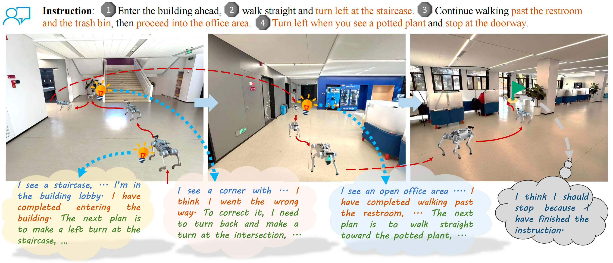

<div align="center">

# AwareVLN: Reasoning with Self-awareness for Vision-Language Navigation

<p>
  <a href="https://gwxuan.github.io/AwareVLN/" style="display:inline-block;padding:0.45em 1.15em;margin:0.2em;border-radius:999px;background:#2d2d2d;color:#fff;text-decoration:none;font-weight:500;font-size:0.95em;">Project Page</a>
  <span style="display:inline-block;padding:0.45em 1.15em;margin:0.2em;border-radius:999px;background:#6c757d;color:#fff;font-weight:500;font-size:0.95em;opacity:0.92;">Paper (coming soon)</span>
  <a href="https://github.com/GWxuan/AwareVLN" style="display:inline-block;padding:0.45em 1.15em;margin:0.2em;border-radius:999px;background:#2d2d2d;color:#fff;text-decoration:none;font-weight:500;font-size:0.95em;">Code</a>
</p>

<p><strong>CVPR 2026</strong></p>

<p align="center">
  
</p>

</div>

## 💡 Introduction

AwareVLN equips VLN with sparse **self-aware reasoning** at key nodes. A unified VLM switches between `[REASON]` and `[ACT]`; an automatic data engine provides scalable supervision.


## 🚀 Training
### Installation
To build the training environment, run:
```bash
./environment_setup.sh awarevln
conda activate awarevln
```

### Dataset
Training annotations are produced by our **automatic data engine**, which labels sparse **self-aware reasoning** at key nodes. Download from [AwareVLN-Dataset](https://github.com/GWxuan/AwareVLN) and extract `videos.tar.gz` in each subfolder.

* **r2r / rxr:** Trajectories from rollouts of [NaVILA](https://huggingface.co/a8cheng/navila-llama3-8b-8f), with corrections when needed; reasoning annotations from our data engine.
* **r2rfollow / rxrfollow:** Trajectories that **follow expert** paths; reasoning annotations from our data engine.

* **Human:** Not included. Follow [NaVILA-Dataset](https://huggingface.co/datasets/a8cheng/NaVILA-Dataset): use **[video IDs](https://huggingface.co/datasets/a8cheng/NaVILA-Dataset/blob/main/Human/video_ids.txt)**, download with `yt-dlp`, extract frames via `scripts/extract_rawframes.py` in the [NaVILA repo](https://github.com/a8cheng/NaVILA).

The data should have structure like:
```graphql
AwareVLN-Dataset
├─ reason
|   ├─ r2r
|   |    ├─ _anno_cot
|   |    |    ├─ annotations_shuffle_uni.json
|   |    |    ├─ cot_new.json
|   |    ├─ videos
|   ├─ rxr
|   |    ├─ ...
|   ├─ r2rfollow
|   |    ├─ ...
|   ├─ rxrfollow
|   |    ├─ ...
├─ Human
|   ├─ raw_frames
|   |    ├─ <video_id>
|   |    |    ├─ 0001.jpg
|   |    |    ├─ ...
|   ├─ annotations_shuffled.json
```

### Training
We start from the **NaVILA** pretrained model [navila-llama3-8b-8f](https://huggingface.co/a8cheng/navila-llama3-8b-8f), and fine-tune with our reasoning data to learn **self-aware reasoning**. Our trained **AwareVLN weights** are available [here](https://cloud.tsinghua.edu.cn/d/251e9961f0ca4aa58d80/).

```bash
export AWAREVLN_DATA_ROOT=/path/to/data
bash scripts/train/sft_8frames.sh
```


## 📊 Evaluation

### Installation

This repository builds on [VLN-CE](https://github.com/jacobkrantz/VLN-CE), which relies on older versions of [Habitat-Lab](https://github.com/facebookresearch/habitat-lab/tree/v0.1.7) and [Habitat-Sim](https://github.com/facebookresearch/habitat-sim/tree/v0.1.7). The installation process can be complex.

1. Create conda env `awarevln-eval` (Python 3.10)

```bash
conda create -n awarevln-eval python=3.10
conda activate awarevln-eval
```

2. Build Habitat-Sim & Lab (v0.1.7) from **source**

Follow the [VLN-CE setup guide](https://github.com/jacobkrantz/VLN-CE?tab=readme-ov-file#setup).

3. Install VLN-CE dependencies
```bash
pip install -r evaluation/requirements.txt
```

4. Install VILA dependencies
```bash
pip install https://github.com/Dao-AILab/flash-attention/releases/download/v2.5.8/flash_attn-2.5.8+cu122torch2.3cxx11abiFALSE-cp310-cp310-linux_x86_64.whl

pip install -e .
pip install -e ".[train]"
pip install -e ".[eval]"

pip install git+https://github.com/huggingface/transformers@v4.37.2
site_pkg_path=$(python -c 'import site; print(site.getsitepackages()[0])')
cp -rv ./llava/train/transformers_replace/* $site_pkg_path/transformers/
cp -rv ./llava/train/deepspeed_replace/* $site_pkg_path/deepspeed/
```

5. Fix WebDataset version
```bash
pip install webdataset==0.1.103
```

### Data
Follow [VLN-CE](https://github.com/jacobkrantz/VLN-CE) and download R2R / RxR annotations and MP3D scenes under `evaluation/data/` (Val-Unseen, monocular RGB):
```graphql
evaluation/data/datasets
├─ RxR_VLNCE_v0
|   ├─ val_unseen
|   |    ├─ val_unseen_guide.json.gz
|   |    ├─ ...
├─ R2R_VLNCE_v1-3_preprocessed
|   ├─ val_unseen
|   |    ├─ val_unseen.json.gz
|   |    ├─ ...
evaluation/data/scene_datasets
├─ mp3d
|   ├─ 17DRP5sb8fy
|   |    ├─ 17DRP5sb8fy.glb
|   |    ├─ ...
```

### Running Evaluation
1. Trained **AwareVLN weights** are available [here](https://cloud.tsinghua.edu.cn/d/251e9961f0ca4aa58d80/), or use your own `outputs/`.
2. R2R-CE:
```bash
cd evaluation
bash scripts/eval/r2r.sh
```
Examples:
* Single GPU:
    ```bash
    MODEL_PATH=../ck/awarevln TOTAL_CHUNKS=1 GPU_LIST="0" bash scripts/eval/r2r.sh
    ```
* Multiple GPUs (e.g., 8 GPUs):
    ```bash
    MODEL_PATH=../ck/awarevln TOTAL_CHUNKS=8 GPU_LIST="0,1,2,3,4,5,6,7" bash scripts/eval/r2r.sh
    ```
3. RxR-CE:
```bash
MODEL_PATH=../ck/awarevln bash scripts/eval/rxr.sh
```
4. Results are saved under `evaluation/eval_awarevln/<CKPT_NAME>/`. Metrics are aggregated automatically; to re-run:
```bash
python scripts/eval_jsons.py eval_awarevln/awarevln/VLN-CE-v1/val_unseen 8
python scripts/eval_jsons.py eval_awarevln/awarevln/RxR-VLN-CE-v1/val_unseen 4
```

## 🎬 Demo

Representative navigation episodes in simulation and the real world. The model performs structured reasoning during navigation—for example, detecting a misinterpreted turn and issuing a corrective plan, or recognizing a completed subtask and planning the next phase aligned with the instruction.

<p align="center">
  
</p>


_______________________________________________________________

## 📜 Citation

```bibtex
@inproceedings{guo2026awarevln,
    title     = {AwareVLN: Reasoning with Self-awareness for Vision-Language Navigation},
    author    = {Wenxuan Guo and Xiuwei Xu and Yichen Liu and Xiangyu Li and Hang Yin and Huangxing Chen and Wenzhao Zheng and Jianjiang Feng and Jie Zhou and Jiwen Lu},
    booktitle = {Proceedings of the {IEEE/CVF} Conference on Computer Vision and Pattern Recognition},
    year      = {2026}
}
```
